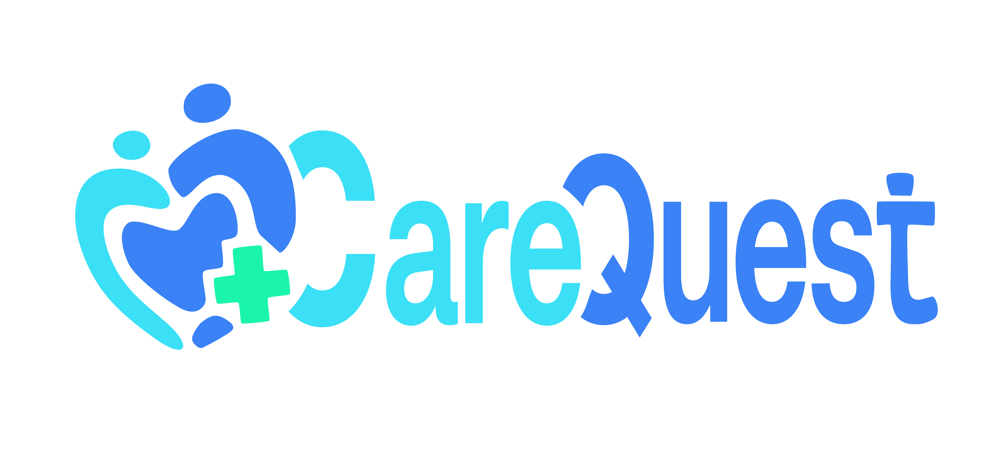

# 💙 CareQuest — BIP EduTech Start-Up MVP

<p align="center">
  
</p>

<p align="center">
  <strong>Safe learning, creativity and connection during recovery.</strong>
</p>

<p align="center">
  
  
  
  
</p>

---

## 🌐 Live demo

**CareQuest:** https://avuii.github.io/CareQuest/

---

## 📌 About the project

**CareQuest** is a social-impact EdTech MVP created during the **BIP EduTech Start-Up programme** at **ISPGAYA — Instituto Superior Politécnico Gaya** in **Vila Nova de Gaia, Portugal**.

The project focuses on children and teenagers who are temporarily away from normal school and social life due to hospitalization, clinical treatment or home recovery.

CareQuest does not replace school, therapy or medical care.  
Instead, it offers a safe and friendly digital space where young users can join short, interactive and age-adapted learning activities, collaborate with others and stay socially connected during recovery.

> ⚠️ Educational MVP only.  
> The app uses fictional users and mock data. No real medical, patient or sensitive data is collected.

---

## 🎯 Project goal

The goal of CareQuest is to demonstrate how technology can support children during difficult periods by combining:

- short live learning sessions,
- age-adapted activities,
- energy-level-based recommendations,
- peer interaction,
- simple rewards and badges,
- child-friendly design,
- safe access flows for parents, hosts and institutions.

The MVP was designed to show one clear user journey:  
a child enters the platform, selects their age group and energy level, explores activities, joins a session, completes a challenge and receives feedback.

---

## ✨ Features

### 👤 User flow

- Simple role-based login:
  - Child
  - Parent / Guardian
  - Host
  - Hospital / Clinic
- Age group selection
- Daily energy level check
- Personalized child dashboard
- Local user progress saved in browser storage

### 📚 Learning experience

- Activity catalogue with future-skills topics
- Age-adapted sessions
- Energy-level filtering
- Activity cards with:
  - topic,
  - duration,
  - difficulty,
  - energy level,
  - host,
  - capacity,
  - live/upcoming status
- Simulated live learning session
- Group challenge concept
- Completion feedback and badges

### 🗓️ Schedule

- Weekly calendar view
- Daily plan view
- Enrolled sessions
- Live session indicator
- Join / enroll / cancel flow
- Mini schedule card on dashboard

### 🏆 Rewards and engagement

- Achievements view
- Badge collection
- Progress cards
- Stars reward balance
- Shop system with:
  - avatars,
  - buddies,
  - frames,
  - visual themes

### 🎨 UI / UX

- CareQuest logo and brand assets
- Soft gradients
- Glassmorphism-style cards
- Rounded child-friendly interface
- Calm blue, aqua, mint and pastel accents
- Friendly animations and hover effects
- Responsive dashboard-oriented layout

---

## 🧱 Tech stack

| Area | Technologies |
|---|---|
| Frontend | React, TypeScript |
| Build tool | Vite |
| UI | CSS-in-JS / inline styles |
| Icons | Lucide React |
| State / mock data | React state, LocalStorage |
| Deployment | GitHub Pages |
| Assets | Custom CareQuest logo and branding |

---

## 🧩 MVP journey

The prototype demonstrates the following core journey:

1. A child enters CareQuest through a simple login flow.
2. The child selects an age group.
3. The child chooses their current energy level.
4. The dashboard suggests suitable activities.
5. The child explores the activity catalogue.
6. The child enrolls in a session.
7. The child checks the schedule.
8. The child joins a simulated live session.
9. The child completes a challenge.
10. The child receives feedback, badges and Stars.

---

## 📁 Project structure

```txt
├── .github/
│   └── workflows/
│
├── guidelines/
│
├── public/
│
├── src/
│   ├── app/
│   │   ├── assets/
│   │   │   ├── carequest-logo-full.png
│   │   │   ├── carequest-logo-icon.png
│   │   │   └── carequest-wordmark.png
│   │   │
│   │   ├── components/
│   │   │   ├── ActivityCatalogue.tsx
│   │   │   ├── AchievementsView.tsx
│   │   │   ├── DailyScheduleCalendar.tsx
│   │   │   ├── EnergySelection.tsx
│   │   │   ├── LoginScreen.tsx
│   │   │   ├── MiniScheduleCard.tsx
│   │   │   ├── ScheduleView.tsx
│   │   │   ├── ShopView.tsx
│   │   │   ├── Sidebar.tsx
│   │   │   └── index.ts
│   │   │
│   │   ├── mock/
│   │   │   ├── courseSessions.ts
│   │   │   └── mockDatabase.ts
│   │   │
│   │   └── App.tsx
│   │
│   ├── imports/
│   ├── styles/
│   └── main.tsx
│
├── .gitignore
├── ATTRIBUTIONS.md
├── README.md
├── package.json
└── vite.config.ts
```

---

## ▶️ Run locally
1. Clone the repository  
```
git clone https://github.com/Avuii/CareQuest.git
cd CareQuest
```
2. Install dependencies  
```npm install```  
3. Start the development server  
```npm run dev```  
The app should be available at:  
```http://localhost:5173```  
4. Build the project  
```npm run build```  
5. Preview production build  
```npm run preview```  

---

## 🧪 Mock data

CareQuest currently uses a local mock database stored in the browser with localStorage.  

The mock database stores example user data such as:
- username,
- selected role,
- selected age group,
- selected energy level,
- Stars balance,
- owned shop items,
- equipped avatar,
- equipped buddy,
- equipped frame,
- equipped theme,
- enrolled sessions.
  
The storage key used by the app is:    
```carequest_mock_database_v1```  
    
To reset the mock data, open the browser console and run:  
```localStorage.removeItem("carequest_mock_database_v1");```  
  
Then refresh the page.  

---

## 🚀 Deployment

The project is deployed with GitHub Pages.  
  
For Vite project pages, the repository name must be configured as the base path in vite.config.ts:  
```
import { defineConfig } from "vite";
import react from "@vitejs/plugin-react";

export default defineConfig({
  plugins: [react()],
  base: "/CareQuest/",
});
```
After building and deploying, the app is available at:  
https://avuii.github.io/CareQuest/  

---

## 🧠 MVP scope

Included in the MVP
- fictional users,
- role-based entry flow,
- age group selection,
- energy level selection,
- mock activity catalogue,
- simulated live sessions,
- schedule and enrollment flow,
- feedback and achievements,
- Stars reward system,
- avatar / buddy / frame / theme shop,
- child-friendly interface,
- local browser-based mock data.

Not included in the MVP
- real patient profiles,
- real medical data,
- real payments,
- production authentication,
- backend API,
- hospital system integration,
- native video conferencing,
- real volunteer verification,
- full school curriculum,
- advanced analytics dashboard.

---

## 🎨 Design direction
The visual direction of CareQuest is based on a soft and trustworthy EdTech identity.  
  
The interface uses:
- blue, aqua and mint brand colors,
- pastel accent colors,
- rounded cards,
- friendly icons,
- soft gradients,
- clean spacing,
- playful but credible UI elements.
  
The goal was to make the app feel friendly for children, while still looking trustworthy for parents, hospitals, clinics and institutional partners.  

---

## 🔮 Future improvements
Possible next steps for the project:

- add a real backend API,
- implement authentication,
- create separate dashboards for parent, host and hospital roles,
- dd real-time session features,
- add moderated chat,
- improve accessibility,
- add more age groups and activity categories,
- add multilingual support,
- add safe consent and approval flows,
- prepare the app for a controlled pilot scenario.

---

## 🌍 Project context
CareQuest was created as part of an international BIP EduTech Start-Up experience in Portugal.  
  
The project combined:
- business planning,
- startup concept development,
- EdTech research,
- UI / UX design,
- frontend development,
- MVP prototyping,
- teamwork in an international environment.

---

## 👥 Project team
  
CareQuest was created by an international student team during the **BIP EduTech Start-Up programme** in Vila Nova de Gaia, Portugal.
  
| Name | Country | University | Field of studies | Main contribution area |
|---|---|---|---|---|
| Rui Silva | Portugal | ISPGAYA | Management | Business Plan / Financial |
| Dominik Ratajczak | Poland | University of Łódź | Management | Business Plan / Financial |
| Katarzyna Stańczyk (Avui) | Poland | University of Łódź | Computer Science | Software Development |
| Simon Margerin | France | IUT de Lens | Multimedia | Communication / Audiovisual |
| Jing Yeng Chew (Gary) | Ireland | DKIT | Computer Science | Software Development |
| Jonathan Favre | France | IUT de Montpellier | Management | Strategy |
| Mateusz Kluziński | Poland | Lodz University of Technology | Computer Science | Software Development |

---

## 🧑‍💻 Implementation

Frontend implementation and software development work by **Avui / Katarzyna Stańczyk**, as part of the international CareQuest project team.

GitHub: https://github.com/Avuii    
Live project: https://avuii.github.io/CareQuest/  
